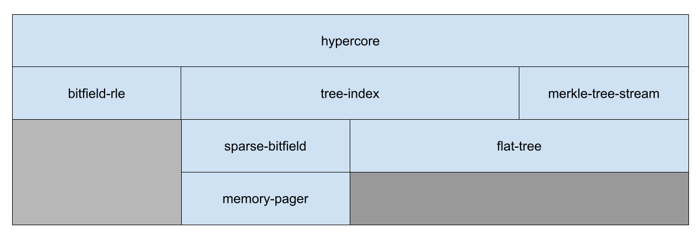

# go-hypercore

[![build status][1]][2]

[Hypercore](https://hypercore-protocol.org/) implementation in Go

Adapted from [Dat Rust](https://github.com/datrs/hypercore) and [hypercore](https://github.com/hypercore-protocol/hypercore). 

**WIP; see module roadmap below**

## Modules

- [ ] tree-index
- [x] [merkle-tree-stream](https://github.com/kiambogo/go-hypercore/blob/main/merkle/stream.go)
- [x] [bitfield-rle](https://github.com/kiambogo/go-hypercore/blob/main/bitfield/rle.go)
- [x] [flat-tree](https://github.com/kiambogo/go-hypercore/blob/main/flattree/tree.go)
- [x] [sparse-bitfield](https://github.com/kiambogo/go-hypercore/blob/main/bitfield/bitfield.go)
- [x] [memory-pager](https://github.com/kiambogo/go-hypercore/blob/main/mempager/pager.go)

## License
[MIT](./LICENSE)

[1]: https://github.com/kiambogo/go-hypercore/actions/workflows/test.yml/badge.svg
[2]: https://github.com/kiambogo/go-hypercore/actions/workflows/test.yml
